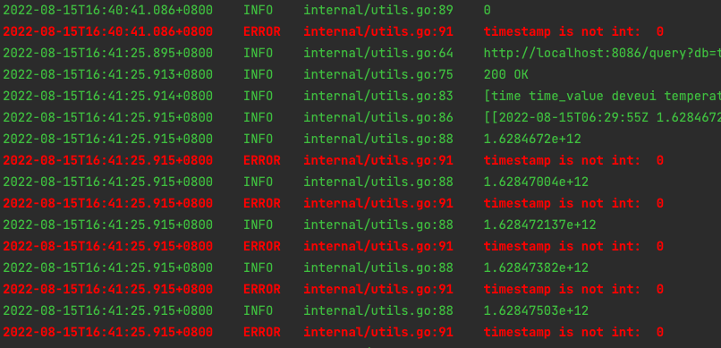

# golang_logger

## install
```shell
go get -u github.com/dat0106/golang_logger
```

## usage
```go
package main

import (
	selfLogger "github.com/dat0106/golang_logger"
)

var (
	// create main.log
	Logger = selfLogger.InitLogger("main")
)

func main() {
	Logger.Info("Starting...")
	Logger.Error("Error happen")
}

```


